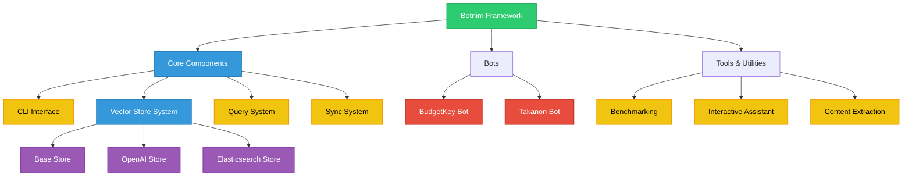
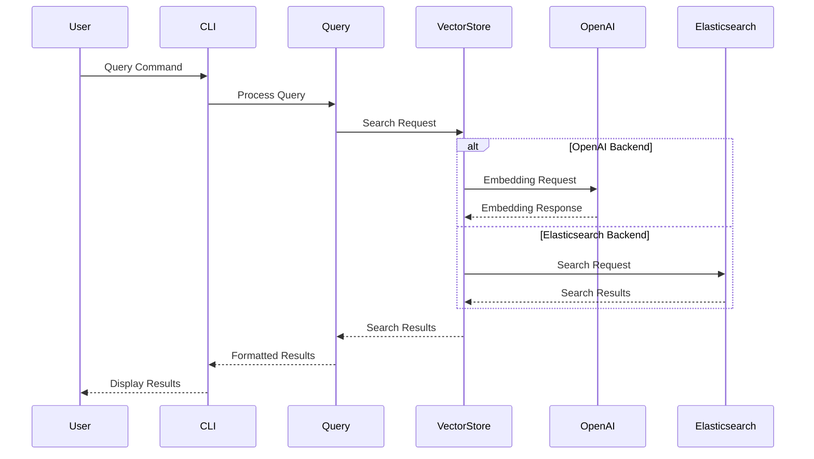

# Botnim CLI Guide

## Overview
Botnim is a CLI tool for interacting with and evaluating bots that provide information about the Israeli budget and Knesset bylaws. This guide will help you understand how to use the various commands and features.

## Available Bots and Contexts

### BudgetKey Bot
Contexts:
- `common_knowledge`: General knowledge about the Israeli budget system
  - Contains information about budget items, ministries, and general budget concepts
  - Source: Common knowledge markdown file

### Takanon Bot
Contexts:
- `common_knowledge`: General knowledge about Knesset bylaws
  - Source: Google Spreadsheet
- `legal_text`: Knesset Bylaws and related laws
  - Source: Extracted markdown files

## Basic Commands

### 1. Querying the Vector Store

```bash
# Search in the vector store
botnim query search <environment> <bot> <context> "your query here"

# Examples:
botnim query search staging takanon common_knowledge "מה עושה יושב ראש הכנסת?"
botnim query search staging budgetkey common_knowledge "מהו תקציב משרד החינוך?"

# Options:
--num-results, -n: Number of results to return (default: 7)
--full, -f: Show full content of results
--rtl: Display results in right-to-left order (for Hebrew/Arabic)
```

#### Query Mechanism

The search process works as follows:

1. **Query Processing**:
   - Your query text is sent to OpenAI's embedding model
   - The text is converted into a vector representation
   - The vector is used to find similar documents in the vector store

2. **Result Formatting**:
   - Results can be returned in three formats:
     - `dict`: Raw dictionary with all metadata
     - `text`: Formatted text with document content
     - `text-short`: Brief summary of each result

3. **Store ID Format**:
   - The system uses a specific format for store IDs: `{bot}__{context}`
   - Example: `takanon__legal_text`
   - This format is used internally to identify the correct vector store

4. **Search Parameters**:
   - `num_results`: Controls how many matches to return
   - `full`: When enabled, shows complete document content
   - `rtl`: Enables right-to-left text formatting for Hebrew/Arabic

5. **Example API Usage**:
```python
from botnim.query import run_query

# Basic search
results = run_query(
    store_id="takanon__legal_text",
    query_text="What is the role of the Knesset Speaker?",
    num_results=5,
    format="text"
)

# Search with full content
results = run_query(
    store_id="budgetkey__common_knowledge",
    query_text="Explain the budget approval process",
    num_results=3,
    format="text-short"
)
```

### 2. Listing Available Indexes

```bash
# List all available indexes
botnim query list-indexes <environment>

# Filter by bot
botnim query list-indexes staging --bot takanon

# Options:
--rtl: Display results in right-to-left order
```

### 3. Viewing Index Structure

```bash
# Show fields/structure of an index
botnim query show-fields <environment> <bot> <context>

# Example:
botnim query show-fields staging takanon legal_text

# Options:
--rtl: Display results in right-to-left order
```

### 4. Evaluating Query Performance

The evaluation system allows you to measure the performance of your queries against a vector store. It uses a CSV file containing test questions and expected results to calculate various metrics.

```bash
# Basic evaluation
botnim evaluate <bot> <context> <environment> <path/to/query_evaluations.csv>

# Example:
botnim evaluate takanon legal_text staging path/to/query_evaluations.csv

# Options:
--max-results: Maximum number of results to retrieve per query (default: 20)
--adjusted-f1-limit: Number of documents to consider for adjusted F1 score (default: 7)
```

#### Query Evaluation Mechanism

The evaluation process works as follows:

1. **Input CSV Format**:
   Your CSV file should include these columns:
   - `question_id`: Unique identifier for each question
   - `question_text`: The actual question text
   - `doc_filename`: The filename of the expected document
   - `is_expected`: Boolean indicating if the document is expected in results

2. **Evaluation Process**:
   - Each question is processed through the vector store search
   - Results are compared against expected documents
   - Multiple metrics are calculated:
     - Recall: Ratio of expected documents found
     - Precision: Ratio of retrieved documents that were expected
     - F1 Score: Harmonic mean of precision and recall
     - Adjusted F1 Score: F1 score considering only top N results

3. **Output**:
   The evaluation generates a new CSV file (`query_evaluations_results.csv`) with detailed metrics:
   - `was_retrieved`: Whether the expected document was found
   - `retrieved_rank`: Position where the document was found
   - `retrieved_score`: Similarity score of the match
   - `f1_score`: Standard F1 score
   - `adjusted_f1_score`: F1 score for top N results

4. **Example Usage**:
```bash
# Create a test CSV file
echo "question_id,question_text,doc_filename,is_expected
1,What is the role of the Knesset Speaker?,speaker_role.md,true
2,How are laws passed in the Knesset?,law_process.md,true" > test_queries.csv

# Run evaluation
botnim evaluate takanon legal_text staging test_queries.csv --max-results 10

# View results
cat query_evaluations_results.csv
```

5. **Best Practices for Evaluation**:
   - Start with a small set of test queries (5-10)
   - Include both easy and challenging questions
   - Test with different result limits (--max-results)
   - Compare results across different contexts
   - Use the adjusted F1 score for more realistic performance measurement

### 5. Interactive Assistant

```bash
# Start interactive chat
botnim assistant

# Options:
--assistant-id: ID of specific assistant to chat with
--openapi-spec: Either "budgetkey" or "takanon"
--rtl: Enable RTL support for Hebrew/Arabic
--environment: Specify environment (default: staging)
```

### 6. Syncing Bots

```bash
# Sync bots to Airtable
botnim sync <environment> <bots>

# Example:
botnim sync staging takanon

# Options:
--replace-context: Replace existing context
--backend: Choose vector store backend (es/openai, default: openai)
```

### 7. Running Benchmarks

```bash
# Run benchmarks
botnim benchmarks <environment> <bots>

# Example:
botnim benchmarks staging takanon

# Options:
--local: Run benchmarks locally
--reuse-answers: Reuse existing answers
--select: failed/all/AirTable record ID
--concurrency: Set concurrency level
```

## Environments
- `staging`: Development environment
- `production`: Production environment

## Available Bots
- `budgetkey`: Bot for Israeli budget information
- `takanon`: Bot for Knesset bylaws information

## CSV Format for Evaluation
When evaluating queries, your CSV file should include the following columns:
- `question_id`: Unique identifier for each question
- `question_text`: The actual question text
- `doc_filename`: The filename of the expected document

## Best Practices
1. Always start with the `staging` environment for testing
2. Use the `--rtl` flag when working with Hebrew text
3. For complex queries, use the interactive assistant
4. When evaluating performance, start with a small set of test queries
5. Use `--replace-context` when you need to force a complete rebuild of the vector store

## Troubleshooting
1. If queries return no results:
   - Check if the bot and context are correct
   - Verify the environment is properly set up
   - Try using the `--full` flag to see more details

2. If evaluation fails:
   - Ensure your CSV file has the required columns
   - Check file permissions and paths
   - Verify the bot and context exist in the specified environment

3. If sync fails:
   - Check your internet connection
   - Verify API keys and credentials
   - Try with `--replace-context` if the context has been modified 


   ## Folder Structure Map


## Main Components Interaction Diagram


## Main Execution Flow
```mermaid
flowchart TD
    A[User Input] --> B[CLI Interface]
    B --> C{Command Type}
    C -->|Query| D[Query Processor]
    C -->|Sync| E[Sync Handler]
    C -->|Assistant| F[Interactive Assistant]
    
    D --> G[Vector Store]
    G --> H[OpenAI/Elasticsearch]
    H --> I[Results]
    I --> J[Display]
    
    E --> K[Config Update]
    K --> L[Vector Store Update]
    L --> M[Status Report]
    
    F --> N[OpenAI API]
    N --> O[Response Processing]
    O --> P[Display]
  ```