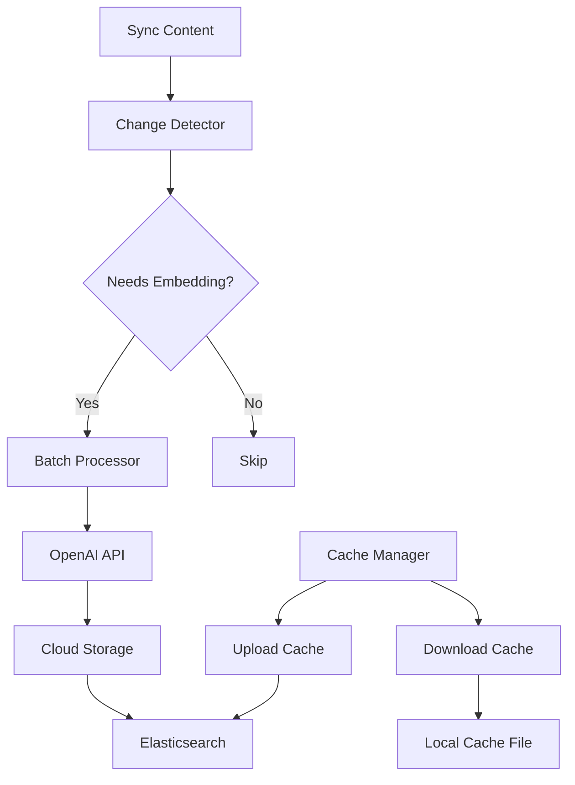

# Content Embedding and Vectorization Documentation

This document describes the cloud-based embedding storage and change detection system for the automated sync infrastructure.

## Overview

The embedding processing system provides:

1. **Cloud-based Embedding Storage** - Persistent embedding storage using Elasticsearch
2. **Change Detection** - Intelligent detection of documents needing re-embedding
3. **Batch Processing** - Efficient batch generation of embeddings
4. **Cache Management** - Download/upload mechanisms for embedding cache
5. **Integration** - Seamless integration with the main sync workflow

## Architecture



## Core Components

### 1. CloudEmbeddingStorage

Elasticsearch-based persistent storage for embeddings.

**Key Features:**
- Stores embeddings with metadata in Elasticsearch
- Supports batch operations for efficiency
- Automatic index creation and management
- Content deduplication using content hashes

**Usage:**
```python
from botnim.sync import CloudEmbeddingStorage

storage = CloudEmbeddingStorage(vector_store)

# Store a single embedding
embedding_info = EmbeddingInfo(
    content_hash="abc123",
    embedding_vector=[0.1, 0.2, ...],
    model="text-embedding-3-small",
    created_at=datetime.now(timezone.utc),
    source_id="test-source",
    content_size=100,
    metadata={}
)

success = storage.store_embedding(embedding_info)

# Batch store embeddings
count = storage.batch_store_embeddings([embedding_info1, embedding_info2])
```

### 2. EmbeddingChangeDetector

Detects when documents need re-embedding based on content changes.

**Detection Logic:**
- No existing embedding found
- Content hash has changed
- Embedding model has changed
- Embedding is too old (configurable threshold)

**Usage:**
```python
from botnim.sync import EmbeddingChangeDetector

detector = EmbeddingChangeDetector(embedding_storage, sync_cache)

# Check if document needs embedding
needs_embedding, reason = detector.needs_embedding(
    content="Document content",
    source_id="source-1",
    version_info=version_info
)

# Filter documents needing embedding
documents_to_process = detector.get_documents_needing_embedding(all_documents)
```

### 3. BatchEmbeddingProcessor

Handles efficient batch processing of embeddings.

**Features:**
- Configurable batch size (default: 50)
- Parallel processing with thread pools
- Error handling and retry logic
- Progress tracking and reporting

**Usage:**
```python
from botnim.sync import BatchEmbeddingProcessor

processor = BatchEmbeddingProcessor(
    openai_client=openai_client,
    embedding_storage=storage,
    batch_size=50,
    max_workers=3
)

# Process documents in batches
results = processor.process_documents(documents)
```

### 4. EmbeddingCacheManager

Manages download/upload of embedding cache for cloud-native operations.

**Features:**
- Download entire embedding cache from Elasticsearch
- Upload local cache to Elasticsearch
- JSON-based local cache format
- Handles large datasets with pagination

**Usage:**
```python
from botnim.sync import EmbeddingCacheManager

cache_manager = EmbeddingCacheManager(
    embedding_storage=storage,
    local_cache_path="./cache/embeddings.json"
)

# Download cache from cloud
download_results = cache_manager.download_cache()

# Upload cache to cloud
upload_results = cache_manager.upload_cache()
```

### 5. SyncEmbeddingProcessor

Main orchestrator that integrates all components with the sync workflow.

**Features:**
- Coordinates all embedding operations
- Integrates with sync cache for logging
- Provides unified interface for embedding processing
- Manages component lifecycle

**Usage:**
```python
from botnim.sync import SyncEmbeddingProcessor

processor = SyncEmbeddingProcessor(
    vector_store=vector_store,
    openai_client=openai_client,
    sync_cache=sync_cache,
    embedding_cache_path="./cache/embeddings.sqlite"
)

# Process content from sync workflow
results = processor.process_sync_content(processed_content)

# Get storage statistics
stats = processor.get_embedding_statistics()

# Manage cache
download_results = processor.download_embedding_cache()
upload_results = processor.upload_embedding_cache()
```

## CLI Commands

The embedding system provides comprehensive CLI commands for management and monitoring.

### Process Embeddings

Process documents for embedding generation:

```bash
# Process embeddings from sync configuration
botnim sync embedding-process --config-file specs/takanon/sync_config.yaml --environment staging
```

### View Statistics

Show embedding storage statistics:

```bash
# View embedding statistics
botnim sync embedding-stats --environment staging
```

### Manage Cache

Download and upload embedding cache:

```bash
# Download embedding cache from cloud
botnim sync embedding-download --cache-file ./cache/embeddings.json --environment staging

# Upload embedding cache to cloud
botnim sync embedding-upload --cache-file ./cache/embeddings.json --environment staging
```

## Configuration

Embedding settings are configured in the sync configuration file:

```yaml
# Storage configuration
cache_directory: "./cache"
embedding_cache_path: "./cache/embeddings.sqlite"

# Processing configuration
max_concurrent_sources: 5
timeout_per_source: 300
```

## Data Models

### EmbeddingInfo

Represents a document embedding with metadata:

```python
@dataclass
class EmbeddingInfo:
    content_hash: str           # SHA-256 hash of content
    embedding_vector: List[float]  # 1536-dimensional vector
    model: str                  # OpenAI model used
    created_at: datetime        # Creation timestamp
    source_id: str             # Source identifier
    content_size: int          # Content size in bytes
    metadata: Dict[str, Any]   # Additional metadata
```

### EmbeddingBatch

Represents a batch of documents for processing:

```python
@dataclass
class EmbeddingBatch:
    batch_id: str              # Unique batch identifier
    documents: List[Dict[str, Any]]  # Documents to process
    batch_size: int            # Number of documents
    created_at: datetime       # Creation timestamp
    status: str               # Processing status
```

## Elasticsearch Schema

Embeddings are stored in Elasticsearch with the following mapping:

```json
{
  "mappings": {
    "properties": {
      "content_hash": {"type": "keyword"},
      "embedding_vector": {
        "type": "dense_vector",
        "dims": 1536
      },
      "model": {"type": "keyword"},
      "created_at": {"type": "date"},
      "source_id": {"type": "keyword"},
      "content_size": {"type": "integer"},
      "metadata": {"type": "object"},
      "version_hash": {"type": "keyword"},
      "content_preview": {"type": "text"},
      "sync_timestamp": {"type": "date"}
    }
  }
}
```

## Integration with Sync Workflow

The embedding processor integrates seamlessly with the main sync workflow:

1. **Content Processing**: After HTML, PDF, or spreadsheet content is processed
2. **Change Detection**: System checks if embeddings need updating
3. **Batch Processing**: New/changed content is processed in batches
4. **Storage**: Embeddings are stored in Elasticsearch
5. **Logging**: Operations are logged in sync cache

```python
# Integration example
def sync_workflow_with_embeddings():
    # 1. Process content sources (HTML, PDF, spreadsheets)
    processed_content = process_all_sources(config)
    
    # 2. Generate embeddings for new/changed content
    embedding_results = embedding_processor.process_sync_content(processed_content)
    
    # 3. Upload to final vector store
    upload_to_vector_store(processed_content, embeddings)
```

## Performance Considerations

### Batch Processing

- **Default batch size**: 50 documents
- **Configurable concurrency**: 3 worker threads
- **Rate limiting**: Respects OpenAI API limits

### Caching Strategy

- **Content-based deduplication**: Identical content reuses embeddings
- **Model versioning**: Automatic re-embedding when model changes
- **Expiration**: Optional re-embedding after 1 year

### Storage Optimization

- **Elasticsearch storage**: Efficient dense vector storage
- **Compression**: JSON compression for local cache
- **Pagination**: Handles large datasets with scroll API

## Monitoring and Troubleshooting

### Logging

All operations are logged with structured logging:

```
INFO:embedding_processor:Processing 150 documents for embedding
INFO:embedding_processor:75 documents need embedding
INFO:embedding_processor:Batch batch_20240101_120000_0 completed: 50 processed, 0 failed
INFO:embedding_processor:Stored 150 embeddings in cloud storage
```

### Error Handling

Common error scenarios and handling:

1. **OpenAI API errors**: Retry with exponential backoff
2. **Elasticsearch errors**: Graceful degradation and logging
3. **Content processing errors**: Skip individual documents, continue batch
4. **Memory errors**: Automatic batch size reduction

### Monitoring Metrics

Track these metrics for system health:

- **Embedding processing rate**: Documents per minute
- **Error rate**: Failed embeddings percentage
- **Storage growth**: Elasticsearch index size
- **Cache hit rate**: Reused embeddings percentage

## Best Practices

### Configuration

1. **Set appropriate batch size** based on available memory and API limits
2. **Configure worker threads** based on CPU cores and API rate limits
3. **Monitor storage usage** and clean up old embeddings periodically

### Content Processing

1. **Preprocess text** to remove unnecessary whitespace and formatting
2. **Chunk large documents** to stay within embedding model limits
3. **Use consistent text encoding** across all content sources

### Production Deployment

1. **Use staging environment** for testing configuration changes
2. **Monitor Elasticsearch health** and storage capacity
3. **Implement backup strategy** for embedding cache
4. **Set up alerts** for embedding processing failures

## API Reference

### CloudEmbeddingStorage

```python
class CloudEmbeddingStorage:
    def __init__(self, vector_store: VectorStoreES, index_prefix: str = "sync_embeddings")
    def store_embedding(self, embedding_info: EmbeddingInfo) -> bool
    def get_embedding(self, content_hash: str) -> Optional[EmbeddingInfo]
    def batch_store_embeddings(self, embeddings: List[EmbeddingInfo]) -> int
    def cleanup_old_embeddings(self, days_old: int = 90) -> int
```

### EmbeddingChangeDetector

```python
class EmbeddingChangeDetector:
    def __init__(self, embedding_storage: CloudEmbeddingStorage, sync_cache: SyncCache)
    def needs_embedding(self, content: str, source_id: str, version_info: VersionInfo) -> Tuple[bool, str]
    def get_documents_needing_embedding(self, documents: List[Dict[str, Any]]) -> List[Dict[str, Any]]
```

### BatchEmbeddingProcessor

```python
class BatchEmbeddingProcessor:
    def __init__(self, openai_client: OpenAI, embedding_storage: CloudEmbeddingStorage, 
                 batch_size: int = 50, max_workers: int = 3)
    def process_documents(self, documents: List[Dict[str, Any]]) -> Dict[str, Any]
```

### EmbeddingCacheManager

```python
class EmbeddingCacheManager:
    def __init__(self, embedding_storage: CloudEmbeddingStorage, local_cache_path: str)
    def download_cache(self) -> Dict[str, Any]
    def upload_cache(self) -> Dict[str, Any]
```

### SyncEmbeddingProcessor

```python
class SyncEmbeddingProcessor:
    def __init__(self, vector_store: VectorStoreES, openai_client: OpenAI, 
                 sync_cache: SyncCache, embedding_cache_path: str)
    def process_sync_content(self, processed_content: List[Dict[str, Any]]) -> Dict[str, Any]
    def download_embedding_cache(self) -> Dict[str, Any]
    def upload_embedding_cache(self) -> Dict[str, Any]
    def get_embedding_statistics(self) -> Dict[str, Any]
```

## Examples

### Basic Usage

```python
from botnim.sync import SyncEmbeddingProcessor
from botnim.vector_store.vector_store_es import VectorStoreES
from botnim.cli import get_openai_client

# Initialize components
vector_store = VectorStoreES('', '.', environment='staging')
openai_client = get_openai_client()
sync_cache = SyncCache('./cache')

# Create processor
processor = SyncEmbeddingProcessor(
    vector_store=vector_store,
    openai_client=openai_client,
    sync_cache=sync_cache,
    embedding_cache_path='./cache/embeddings.json'
)

# Process content
processed_content = [
    {
        'content': 'This is a test document',
        'source_id': 'test-doc-1',
        'version_info': version_info
    }
]

results = processor.process_sync_content(processed_content)
print(f"Processed {results['processed_documents']} documents")
```

### Advanced Configuration

```python
# Custom batch processing configuration
batch_processor = BatchEmbeddingProcessor(
    openai_client=openai_client,
    embedding_storage=storage,
    batch_size=25,  # Smaller batches for lower memory usage
    max_workers=5   # More workers for faster processing
)

# Custom change detection logic
class CustomChangeDetector(EmbeddingChangeDetector):
    def needs_embedding(self, content, source_id, version_info):
        # Custom logic for specific requirements
        needs_embedding, reason = super().needs_embedding(content, source_id, version_info)
        
        # Additional custom checks
        if source_id.startswith('high_priority_'):
            # Force re-embedding for high priority sources
            return True, "High priority source"
        
        return needs_embedding, reason
```

This embedding processing system provides a robust, scalable solution for managing document embeddings in the automated sync infrastructure, with comprehensive monitoring, error handling, and cloud-native capabilities.