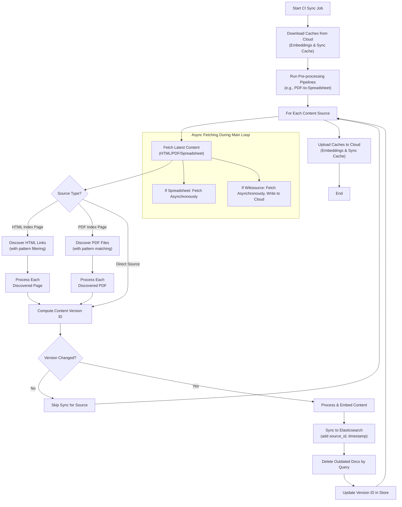

# Sync Orchestration and CI Integration Documentation

This document describes the comprehensive sync orchestration system that coordinates all sync components and provides robust CI/CD integration.

## Overview

The sync orchestration system provides:

1. **Main Orchestration Engine** - Coordinates all sync operations
2. **Pre-processing Pipelines** - Executes multi-step workflows like PDF-to-Spreadsheet before the main sync.
3. **Cloud Cache Management** - Download/upload embedding cache from Elasticsearch
4. **Version Control** - Track changes and process only new content
5. **Document Processing Integration** - Unified interface for HTML, PDF, and spreadsheet processing
6. **Advanced Document Parsing & Chunking** - AI-powered document structure analysis with intelligent chunking
7. **CI/CD Integration** - GitHub Actions workflow with robust error handling
8. **Comprehensive Monitoring** - Detailed logging, reporting, and health checks

## Architecture



## Core Components

### 1. SyncOrchestrator

Main orchestration engine that coordinates all sync operations.

**Key Features:**
- Coordinates all sync components (HTML, PDF, spreadsheet, embedding)
- Manages cloud cache download/upload
- Executes pre-processing pipelines before the main sync loop.
- Provides comprehensive error handling and logging
- Generates detailed sync summaries
- Supports parallel processing with configurable concurrency

**Usage:**
```python
from botnim.sync import SyncOrchestrator, SyncConfig

# Load configuration
config = SyncConfig.from_yaml('specs/takanon/sync_config.yaml')

# Create orchestrator
orchestrator = SyncOrchestrator(config, environment='staging')

# Run complete sync operation
summary = await orchestrator.run_sync()

# Access results
print(f"Processed {summary.total_documents_processed} documents")
print(f"Successful sources: {summary.successful_sources}")
print(f"Failed sources: {summary.failed_sources}")
```

### 2. SyncOrchestratorCLI

Command-line interface for running sync orchestration.

**Features:**
- Load configuration from YAML files
- Run complete sync workflows
- Generate formatted summaries
- Handle errors gracefully with appropriate exit codes

**Usage:**
```bash
# Run sync orchestration
botnim sync orchestrate --config-file specs/takanon/sync_config.yaml --environment staging

# Show comprehensive statistics
botnim sync sync-stats --config-file specs/takanon/sync_config.yaml --environment staging
```

### 4. Document Parsing and Chunking

The sync orchestration system includes advanced document parsing and chunking capabilities for handling large documents efficiently.

**Key Features:**
- **AI-Powered Structure Analysis** - Uses OpenAI models to analyze document hierarchy
- **Intelligent Chunking** - Automatically splits large documents into manageable chunks
- **Hebrew Language Support** - Optimized for Hebrew legal documents with section detection
- **Markdown Generation** - Creates individual markdown files for each chunk
- **Token Limit Optimization** - Prevents embedding API token limit errors

**Configuration:**
```yaml
sources:
  - id: "legal-document"
    name: "Legal Document"
    type: "html"
    html_config:
      url: "https://example.com/legal-document"
      selector: "#content"
    use_document_parser: true  # Enable advanced parsing
    versioning_strategy: "combined"
    enabled: true
```

**Processing Flow:**
1. **Structure Analysis** - AI analyzes document structure and identifies sections
2. **Content Extraction** - Extracts content for each identified section
3. **Chunk Generation** - Creates individual markdown files for each chunk
4. **Embedding Processing** - Processes each chunk separately for embedding

**Example Output:**
```
INFO:botnim.sync.html_fetcher:Using advanced document parser for knesset-law-wikisource
INFO:botnim.document_parser.html_processor.extract_structure:LLM returned 44 structured elements
INFO:botnim.sync.html_fetcher:Advanced parsing completed for knesset-law-wikisource: 26 chunks generated
```

**Benefits:**
- ✅ **Handles Large Documents** - Processes documents of any size
- ✅ **Maintains Context** - Preserves document structure and hierarchy
- ✅ **Optimizes Embeddings** - Creates chunks that fit within API token limits
- ✅ **Improves Search Quality** - More granular search results
- ✅ **Reduces API Costs** - More efficient embedding generation

### 5. SyncResult and SyncSummary

Data structures for tracking sync operation results.

**SyncResult:**
```python
@dataclass
class SyncResult:
    source_id: str              # Source identifier
    source_type: str            # HTML, PDF, spreadsheet
    status: str                 # success, failed, skipped
    processing_time: float      # Processing time in seconds
    documents_processed: int    # Number of documents processed
    documents_failed: int       # Number of documents that failed
    error_message: Optional[str] # Error message if failed
    metadata: Optional[Dict]    # Additional metadata
```

**SyncSummary:**
```python
@dataclass
class SyncSummary:
    total_sources: int          # Total number of sources
    successful_sources: int     # Successfully processed sources
    failed_sources: int         # Failed sources
    skipped_sources: int        # Skipped sources
    total_documents_processed: int  # Total documents processed
    total_documents_failed: int     # Total documents that failed
    total_processing_time: float    # Total processing time
    embedding_cache_downloaded: bool # Cache download status
    embedding_cache_uploaded: bool   # Cache upload status
    errors: List[str]           # List of errors
    results: List[SyncResult]   # Detailed results
```

## Sync Workflow

The orchestrator follows a structured workflow:

### Step 1: Pre-processing Pipelines
```python
# Run all configured pre-processing pipelines (e.g., PDF-to-Spreadsheet)
await orchestrator._run_preprocessing_pipelines()
```

### Step 2: Download Embedding Cache
```python
# Download existing embeddings from cloud storage
cache_downloaded = await orchestrator._download_embedding_cache()
```

### Step 3: Process Content Sources
```python
# Process all enabled sources in parallel
await orchestrator._process_all_sources()
```

### Step 4: Generate Embeddings
```python
# Generate embeddings for new/changed content
await orchestrator._process_embeddings()
```

### Step 5: Upload Embedding Cache
```python
# Upload updated embeddings to cloud storage
cache_uploaded = await orchestrator._upload_embedding_cache()
```

### Step 6: Generate Summary
```python
# Generate comprehensive summary
summary = orchestrator._generate_summary(cache_downloaded, cache_uploaded)
```

## Pre-processing Pipelines

The sync orchestration system supports pre-processing pipelines that run before the main sync loop. These pipelines can perform complex multi-step operations and create new sources for the main sync to process.

### PDF-to-Spreadsheet Pipeline

The PDF-to-Spreadsheet pipeline is a pre-processing workflow that:

1. **Discovers PDFs** from URLs or index pages
2. **Extracts structured data** using AI-powered field extraction
3. **Creates Google Sheets** with the extracted data
4. **Generates new spreadsheet sources** for the main sync to process

**How it integrates with the sync workflow:**

```python
# Step 1: Run pre-processing pipelines
await orchestrator._run_preprocessing_pipelines()

# This step:
# - Identifies PDF_PIPELINE sources in the configuration
# - Executes each pipeline (discover → extract → upload to sheets)
# - Creates new ContentSource objects for the generated spreadsheets
# - Adds these new sources to the config.sources list

# Step 2: Process all sources (including newly created ones)
await orchestrator._process_all_sources()
```

**Example Configuration:**
```yaml
sources:
  - id: "ethics-committee-decisions"
    name: "Ethics Committee Decisions"
    type: "pdf_pipeline"
    enabled: true
    priority: 1
    pdf_pipeline_config:
      input_config:
        url: "https://example.com/ethics-decisions/"
        is_index_page: true
        file_pattern: "*.pdf"
      output_config:
        spreadsheet_id: "your-spreadsheet-id"
        sheet_name: "Ethics_Committee_Decisions"
        use_adc: true
      processing_config:
        model: "gpt-4o-mini"
        fields:
          - name: "decision_number"
            type: "string"
            description: "Number of the ethics decision"
          - name: "decision_date"
            type: "date"
            description: "Date of the decision"
        extraction_instructions: "Extract structured data from ethics committee decisions."
```

**Pipeline Results:**
- **Generated Spreadsheet**: Data uploaded to Google Sheets
- **New Source Created**: `ethics-committee-decisions-generated-spreadsheet` source added to config
- **Main Sync Processing**: The new spreadsheet source is processed like any other spreadsheet source
- **Vectorization**: Content is embedded and indexed in the vector store

**Benefits:**
- ✅ **Seamless Integration**: Generated spreadsheets automatically become part of the sync workflow
- ✅ **Dynamic Splitting**: Supports extracting multiple records from single PDFs
- ✅ **Reusable Components**: Uses existing Google Sheets service and PDF processing infrastructure
- ✅ **Comprehensive Testing**: Full test suite covering all scenarios
- ✅ **Traceability**: Generated sources are tagged with metadata about their origin

### HTML Index Page Discovery

The HTML discovery system automatically discovers and processes multiple HTML pages linked from index pages:

1. **Discovers HTML links** from index pages using pattern filtering
2. **Tracks processed pages** to avoid duplicates
3. **Processes each page individually** using the existing HTML processing pipeline
4. **Integrates seamlessly** with the main sync workflow

**How it integrates with the sync workflow:**

```python
# During source processing, HTML sources with fetch_strategy: "index_page" are handled specially
if source.fetch_strategy == FetchStrategy.INDEX_PAGE:
    # Use HTML discovery processor
    results = self.html_discovery_processor.process_html_source(source)
    # Results include discovered pages that are processed individually
else:
    # Use regular HTML processor
    results = self.html_processor.process_sources([source])
```

**Example Configuration:**
```yaml
sources:
  - id: "example-html-index"
    name: "Example HTML Index Page"
    type: "html"
    html_config:
      url: "https://example.com/index.html"
      selector: "#content"
      link_pattern: ".*relevant.*"  # Filter links containing "relevant"
      encoding: "utf-8"
      timeout: 60
      retry_attempts: 3
    versioning_strategy: "combined"
    fetch_strategy: "index_page"  # Triggers HTML discovery
    enabled: true
    priority: 1
    tags: ["example", "html", "index"]
```

**Discovery Results:**
- **Discovered Pages**: Multiple HTML pages found and filtered by pattern
- **Individual Processing**: Each discovered page is processed as a separate source
- **Duplicate Prevention**: Processed pages are tracked in Elasticsearch to avoid re-processing
- **Integration**: Works with existing HTML processing pipeline and advanced document parsing

**Benefits:**
- ✅ **Automated Discovery**: Automatically finds relevant HTML pages from index pages
- ✅ **Pattern Filtering**: Supports regex patterns to filter relevant links
- ✅ **Duplicate Prevention**: Tracks processed pages to avoid re-processing
- ✅ **Seamless Integration**: Works with existing HTML processing pipeline
- ✅ **Comprehensive Testing**: Full test suite covering discovery and processing workflows

## CLI Commands

### Orchestrate Command

Run comprehensive sync orchestration:

```bash
# Basic orchestration
botnim sync orchestrate --config-file specs/takanon/sync_config.yaml

# With specific environment
botnim sync orchestrate --config-file specs/takanon/sync_config.yaml --environment production

# Example output
🚀 Starting sync orchestration for config: specs/takanon/sync_config.yaml
Environment: staging
🛠️ Step 1: Running pre-processing pipelines
INFO:botnim.sync.orchestrator:No pre-processing pipelines to run.
📥 Step 2: Downloading embedding cache from cloud
✅ Downloaded 1,250 embeddings from cloud
📄 Step 3: Processing content sources
✅ Test HTML Source (html): 5 documents processed
✅ Test PDF Source (pdf): 3 documents processed
🔮 Step 4: Generating embeddings
Generating embeddings for 8 documents
Embedding processing completed: 8 documents processed
📤 Step 5: Uploading embedding cache to cloud
✅ Uploaded 1,258 embeddings to cloud
✅ Sync operation completed successfully

============================================================
📊 SYNC OPERATION SUMMARY
============================================================
Total Sources: 2
Successful: 2 ✅
Failed: 0 ❌
Skipped: 0 ⏭️
Documents Processed: 8
Documents Failed: 0
Total Processing Time: 45.23s
Embedding Cache Downloaded: ✅
Embedding Cache Uploaded: ✅
```

### Sync Stats Command

Show comprehensive sync statistics:

```bash
botnim sync sync-stats --config-file specs/takanon/sync_config.yaml --environment staging

# Example output
📊 Sync Statistics for: Takanon Bot Sync Configuration
==================================================
📈 COMPREHENSIVE SYNC STATISTICS
==================================================
Configuration: Takanon Bot Sync Configuration
Environment: staging
Total Sources: 5
Enabled Sources: 3

💾 Cache Statistics:
  Total Sources: 15
  Processed Sources: 12
  Success Rate: 80.0%
  Cache Size: 2.45 MB

🔮 Embedding Statistics:
  Total Embeddings: 1,258
  Storage Size: 15.67 MB
  Model Distribution:
    text-embedding-3-small: 1,258 embeddings

📝 Version Statistics:
  Tracked Versions: 12
```

## CI/CD Integration

### GitHub Actions Workflow

The system includes a comprehensive GitHub Actions workflow (`.github/workflows/sync-orchestration.yml`) with:

**Triggers:**
- Manual trigger with environment selection
- Scheduled daily sync (2 AM UTC)
- Automatic trigger on configuration changes

**Features:**
- Environment-specific configuration
- Comprehensive logging and artifact storage
- Error handling and notifications
- Health monitoring and reporting
- Test execution and coverage reporting

**Workflow Steps:**

1. **Setup Environment**
   ```yaml
   - name: Set up Python
     uses: actions/setup-python@v4
     with:
       python-version: '3.11'
       cache: 'pip'
   ```

2. **Validate Configuration**
   ```yaml
   - name: Validate sync configuration
     run: |
       python -c "
       from botnim.sync.config import SyncConfig
       config = SyncConfig.from_yaml('${{ github.event.inputs.config_file }}')
       print(f'✅ Configuration loaded: {config.name}')
       "
   ```

3. **Run Sync Orchestration**
   ```yaml
   - name: Run sync orchestration
     run: |
       python -m botnim.sync.cli orchestrate \
         --config-file "${{ github.event.inputs.config_file }}" \
         --environment "${{ env.SYNC_ENVIRONMENT }}" \
         2>&1 | tee ${{ env.LOG_DIR }}/sync-orchestration.log
   ```

4. **Upload Artifacts**
   ```yaml
   - name: Upload sync logs
     uses: actions/upload-artifact@v3
     with:
       name: sync-logs-${{ github.run_id }}
       path: |
         ${{ env.LOG_DIR }}/
         ${{ env.CACHE_DIR }}/
       retention-days: 30
   ```

5. **Generate Reports**
   ```yaml
   - name: Generate sync report
     run: |
       # Create comprehensive markdown report
       cat > ${{ env.LOG_DIR }}/sync-report.md << EOF
       # Sync Orchestration Report
       
       **Run ID:** ${{ github.run_id }}
       **Environment:** ${{ env.SYNC_ENVIRONMENT }}
       **Status:** ${{ steps.sync.outputs.sync_exit_code == '0' && '✅ Success' || '❌ Failed' }}
       EOF
   ```

6. **Notifications**
   ```yaml
   - name: Notify on failure
     if: failure()
     uses: 8398a7/action-slack@v3
     with:
       status: failure
       text: |
         ❌ Sync orchestration failed!
         **Run:** ${{ github.run_id }}
         **Environment:** ${{ env.SYNC_ENVIRONMENT }}
   ```

### Environment Configuration

The workflow supports multiple environments:

**Staging Environment:**
```bash
ES_HOST_STAGING=staging-elasticsearch.example.com
ES_USERNAME_STAGING=staging_user
ES_PASSWORD_STAGING=staging_password
OPENAI_API_KEY=sk-...
```

**Production Environment:**
```bash
ES_HOST_PRODUCTION=prod-elasticsearch.example.com
ES_USERNAME_PRODUCTION=prod_user
ES_PASSWORD_PRODUCTION=prod_password
OPENAI_API_KEY=sk-...
```

### Manual Trigger

The workflow can be manually triggered with parameters:

- **Environment**: staging or production
- **Config File**: Path to sync configuration
- **Force Full Sync**: Optional flag to ignore cache

## Error Handling and Recovery

### Error Recovery Strategies

1. **Partial Failure Handling**
   - Individual source failures don't stop the entire sync
   - Failed sources are logged and reported
   - Successful sources continue processing

2. **Retry Logic**
   - Automatic retries for transient failures
   - Exponential backoff for API calls
   - Configurable retry limits

3. **Graceful Degradation**
   - Cache download failures don't prevent sync
   - Embedding generation continues with available cache
   - Partial results are preserved

### Error Reporting

Comprehensive error reporting includes:

```python
# Error tracking in orchestrator
self.sync_errors: List[str] = []

# Error collection during processing
try:
    result = self._process_single_source(source)
except Exception as e:
    error_msg = f"Failed to process source {source.id}: {e}"
    self.sync_errors.append(error_msg)
```

### Monitoring and Alerting

**Health Checks:**
- Sync completion status
- Error count and types
- Processing time monitoring
- Cache operation success rates

**Alerts:**
- Slack notifications on failure
- Email alerts for critical errors
- Dashboard monitoring for sync health

## Performance Optimization

### Parallel Processing

```python
# Process sources in parallel with thread pool
with ThreadPoolExecutor(max_workers=self.config.max_concurrent_sources) as executor:
    future_to_source = {
        executor.submit(self._process_single_source, source): source
        for source in enabled_sources
    }
```

### Caching Strategy

- **Embedding Cache**: Downloaded before sync, uploaded after
- **Content Cache**: Local SQLite storage for deduplication
- **Version Cache**: Tracks content changes to avoid reprocessing

### Resource Management

- **Memory Management**: Batch processing to control memory usage
- **Connection Pooling**: Reuse connections for external APIs
- **Cleanup**: Proper resource cleanup after processing

## Configuration

### Sync Configuration

The orchestrator uses the existing `SyncConfig` with additional orchestration settings:

```yaml
# Orchestration settings
max_concurrent_sources: 5        # Parallel processing limit
timeout_per_source: 300          # Timeout per source in seconds
cache_directory: "./cache"       # Local cache directory
embedding_cache_path: "./cache/embeddings.sqlite"  # Embedding cache path
version_cache_path: "./cache/versions.json"        # Version cache path
```

### Environment Variables

Required environment variables for CI/CD:

```bash
# Elasticsearch Configuration
ES_HOST_STAGING=staging-elasticsearch.example.com
ES_USERNAME_STAGING=staging_user
ES_PASSWORD_STAGING=staging_password

ES_HOST_PRODUCTION=prod-elasticsearch.example.com
ES_USERNAME_PRODUCTION=prod_user
ES_PASSWORD_PRODUCTION=prod_password

# OpenAI Configuration
OPENAI_API_KEY=sk-...

# Optional: Slack Notifications
SLACK_WEBHOOK_URL=https://hooks.slack.com/services/...
```

## Testing

### Unit Tests

Comprehensive test coverage for all components:

```bash
# Run orchestrator tests
pytest botnim/sync/tests/test_orchestrator.py -v

# Run with coverage
pytest botnim/sync/tests/test_orchestrator.py --cov=botnim.sync.orchestrator --cov-report=html
```

### Integration Tests

End-to-end testing with mocked components:

```python
@pytest.mark.asyncio
async def test_full_sync_workflow_mock():
    """Test the full sync workflow with mocked components."""
    # Mock all external dependencies
    with patch.multiple('botnim.sync.orchestrator', ...):
        orchestrator = SyncOrchestrator(config, "staging")
        summary = await orchestrator.run_sync()
        
        # Verify all steps were called
        assert summary.embedding_cache_downloaded is True
        assert summary.embedding_cache_uploaded is True
```

### CI/CD Testing

The workflow includes automated testing:

```yaml
- name: Run sync tests
  run: |
    pytest botnim/sync/tests/ -v --cov=botnim.sync --cov-report=xml

- name: Upload test coverage
  uses: codecov/codecov-action@v3
  with:
    file: ./coverage.xml
    flags: sync
    name: sync-coverage
```

## Monitoring and Observability

### Logging

Structured logging throughout the system:

```python
logger.info("🚀 Starting comprehensive sync operation")
logger.info(f"📥 Step 1: Downloading embedding cache from cloud")
logger.info(f"✅ Downloaded {count:,} embeddings from cloud")
logger.error(f"❌ Sync operation failed: {e}")
```

### Metrics

Key metrics tracked:

- **Processing Time**: Total and per-source processing time
- **Success Rate**: Percentage of successful operations
- **Error Rate**: Number and types of errors
- **Cache Hit Rate**: Embedding cache reuse efficiency
- **Document Throughput**: Documents processed per minute

### Health Monitoring

Automated health checks:

```yaml
- name: Analyze sync health
  run: |
    ERROR_COUNT=$(grep -c "ERROR\|❌" ./artifacts/logs/sync-orchestration.log || echo "0")
    SUCCESS_COUNT=$(grep -c "✅" ./artifacts/logs/sync-orchestration.log || echo "0")
    HEALTH_SCORE=$(( SUCCESS_COUNT * 100 / (SUCCESS_COUNT + ERROR_COUNT) ))
    echo "Health Score: $HEALTH_SCORE%"
```

## Best Practices

### Configuration Management

1. **Environment Separation**
   - Use separate configurations for staging and production
   - Validate configurations before deployment
   - Version control all configuration changes

2. **Security**
   - Store sensitive credentials as GitHub secrets
   - Use environment-specific API keys
   - Implement proper access controls

### Error Handling

1. **Graceful Degradation**
   - Handle partial failures without stopping the entire sync
   - Preserve successful results even when some operations fail
   - Provide detailed error reporting for debugging

2. **Retry Logic**
   - Implement exponential backoff for transient failures
   - Set appropriate timeout values
   - Log retry attempts for monitoring

### Performance

1. **Parallel Processing**
   - Use appropriate concurrency limits
   - Monitor resource usage during processing
   - Implement proper cleanup to prevent resource leaks

2. **Caching**
   - Leverage embedding cache to avoid redundant processing
   - Implement content deduplication
   - Monitor cache hit rates for optimization

### Monitoring

1. **Comprehensive Logging**
   - Log all major operations with appropriate levels
   - Include timing information for performance monitoring
   - Structure logs for easy parsing and analysis

2. **Health Checks**
   - Implement automated health monitoring
   - Set up alerts for critical failures
   - Track key metrics over time

## API Reference

### SyncOrchestrator

```python
class SyncOrchestrator:
    def __init__(self, config: SyncConfig, environment: str = DEFAULT_ENVIRONMENT)
    async def run_sync(self) -> SyncSummary
    def get_sync_statistics(self) -> Dict[str, Any]
    def cleanup(self)
```

### SyncOrchestratorCLI

```python
class SyncOrchestratorCLI:
    def run_sync_from_config(self, config_path: str, environment: str) -> SyncSummary
    def print_summary(self, summary: SyncSummary)
```

### Convenience Functions

```python
async def run_sync_orchestration(config_path: str, environment: str) -> SyncSummary
def run_sync_orchestration_sync(config_path: str, environment: str) -> SyncSummary
```

## Examples

### Basic Usage

```python
from botnim.sync import SyncOrchestrator, SyncConfig

# Load configuration
config = SyncConfig.from_yaml('specs/takanon/sync_config.yaml')

# Create orchestrator
orchestrator = SyncOrchestrator(config, environment='staging')

try:
    # Run sync
    summary = await orchestrator.run_sync()
    
    # Check results
    if summary.failed_sources > 0:
        print(f"⚠️ Sync completed with {summary.failed_sources} failed sources")
    else:
        print("✅ Sync completed successfully")
        
    print(f"Processed {summary.total_documents_processed} documents")
    
finally:
    # Cleanup
    orchestrator.cleanup()
```

### CLI Usage

```bash
# Run sync orchestration
botnim sync orchestrate --config-file specs/takanon/sync_config.yaml --environment staging

# Check statistics
botnim sync sync-stats --config-file specs/takanon/sync_config.yaml --environment staging

# Run with custom cache directory
botnim sync orchestrate --config-file specs/takanon/sync_config.yaml --cache-dir ./custom-cache
```

### CI/CD Integration

```yaml
# GitHub Actions workflow
- name: Run sync orchestration
  run: |
    python -m botnim.sync.cli orchestrate \
      --config-file "${{ github.event.inputs.config_file }}" \
      --environment "${{ env.SYNC_ENVIRONMENT }}"
  
- name: Check sync status
  run: |
    if [ ${{ steps.sync.outputs.sync_exit_code }} -ne 0 ]; then
      echo "❌ Sync failed"
      exit 1
    else
      echo "✅ Sync completed successfully"
    fi
```

This sync orchestration system provides a robust, scalable, and maintainable solution for coordinating all sync operations with comprehensive CI/CD integration, monitoring, and error handling.
